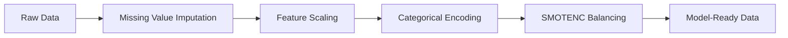

# 🗳️ Election Insight Engine
### ML-Driven Political Analytics for Indian Elections

<div align="center">


**Decoding the dynamics of the world's largest democracy using Advanced Machine Learning**

[Features](#-features) • [Installation](#-installation) • [Usage](#-usage) • [Results](#-results) • [Tech Stack](#-tech-stack)

</div>

---

## 🎯 Project Overview

Predicting election outcomes in India—a nation with 900+ million voters—requires analyzing thousands of variables and complex patterns. This project goes **beyond simple voter turnout analysis** to uncover the hidden drivers of electoral success.

Using state-of-the-art machine learning techniques, this system analyzes historical Indian assembly election data to:
- 🎲 **Classify** winners and losers with 93% accuracy
- 📊 **Predict** exact vote share percentages
- 🗺️ **Segment** constituencies into strategic categories

---

## ✨ Features

### 🔮 Three-Pronged ML Approach

| Model | Purpose | Key Metric |
|-------|---------|------------|
| **Random Forest Classifier** | Win/Loss Prediction | 93% Accuracy |
| **XGBoost Regressor** | Vote Share Forecasting | Precise percentage prediction |
| **K-Means Clustering** | Constituency Segmentation | Identifies Safe Seats vs Battlegrounds |

### 🧠 Key Insights Discovered

Our analysis revealed that **Party affiliation** is the single most dominant predictor of election outcomes. However, three critical non-party factors emerged as game-changers:

1. **👤 Candidate Age** - Experience matters
2. **📈 Turnout Percentage** - Voter engagement drives results
3. **🎪 AC Total Candidates** - Vote fragmentation impacts outcomes

These variables collectively form the "secret sauce" for accurate election prediction.

---

## 🛠️ Tech Stack

<div align="center">

| Category | Technologies |
|----------|-------------|
| **Language** | Python 3.8+ |
| **Data Processing** | Pandas, NumPy |
| **Machine Learning** | Scikit-Learn, XGBoost, Imbalanced-Learn |
| **Visualization** | Matplotlib, Seaborn |
| **Special Techniques** | SMOTENC, StandardScaler, OneHotEncoder |

</div>

---

## 🚀 Getting Started

### Prerequisites

```bash
Python 3.8 or higher
pip package manager
```

### Installation

1. **Clone the repository**
```bash
git clone https://github.com/yourusername/election-insight-engine.git
cd election-insight-engine
```

2. **Install dependencies**
```bash
pip install -r requirements.txt
```

3. **Launch Jupyter Notebook**
```bash
jupyter notebook
```

4. **Explore the analysis**
   - Start with `01_EDA.ipynb` for data exploration
   - Move to `02_Classification_Model.ipynb` for predictive modeling
   - Finish with `03_Clustering.ipynb` for constituency analysis

---

## 📁 Project Structure

```
election-insight-engine/
│
├── data/
│   └── cleaned_election_data.csv    # Processed election dataset
│
├── notebooks/
│   ├── 01_EDA.ipynb                 # Exploratory Data Analysis
│   ├── 02_Classification_Model.ipynb # Win/Loss Prediction Model
│   └── 03_Clustering.ipynb          # Constituency Segmentation
│
├── images/
│   └── feature_importance.png       # Visualization assets
│
├── requirements.txt                 # Python dependencies
└── README.md                        # You are here!
```

---

## 🧹 Data Engineering Pipeline

### Preprocessing Steps



**Key Processing Techniques:**

- ✅ **Missing Values**: Handled via median (numerical) and mode (categorical) imputation
- ✅ **Feature Scaling**: StandardScaler for numerical features
- ✅ **Encoding**: OneHotEncoder for high-cardinality categories (State, Party)
- ✅ **Class Imbalance**: SMOTENC to synthesize minority 'Win' class samples

> **Critical Insight:** Without SMOTENC, the model achieved high accuracy but failed to identify winners—synthetic oversampling was essential for practical utility.

---

## 📊 Model Performance

### Classification Results (Win/Loss Prediction)

| Metric | Score | Notes |
|--------|-------|-------|
| **Accuracy** | 93% | Overall prediction correctness |
| **Precision (Winners)** | 0.68 | Reliability of win predictions |
| **Recall (Winners)** | ⬆️ Significantly Improved | Thanks to SMOTENC |

### Before vs After SMOTENC

| Approach | Accuracy | Winner Detection |
|----------|----------|------------------|
| Without SMOTE | ~95% | ❌ Failed (all predictions = Loss) |
| With SMOTENC | ~93% | ✅ Detects winners effectively |

**Lesson Learned:** High accuracy means nothing if the model can't identify the minority class. SMOTENC made this model politically actionable.

---

## 🎓 Key Learnings

### 1️⃣ Political Intelligence
Party loyalty remains king, but candidate demographics and voter engagement provide crucial competitive edges.

### 2️⃣ Technical Innovation
Class imbalance is the silent killer of political prediction models—synthetic oversampling is non-negotiable.

### 3️⃣ Actionable Insights
Clustering reveals that not all constituencies are created equal—strategic resource allocation begins with understanding seat types.

---

## 🔮 Future Enhancements

- [ ] Integrate social media sentiment analysis
- [ ] Add real-time polling data feeds
- [ ] Develop interactive dashboard for visualization
- [ ] Expand to Lok Sabha (Parliamentary) elections
- [ ] Implement deep learning models (LSTM for time-series)

---

## 🤝 Contributing

Contributions are welcome! Whether you want to:
- 🐛 Report bugs
- 💡 Suggest features
- 📝 Improve documentation
- 🔧 Submit pull requests

Please feel free to open an issue or submit a PR.

---

## 📄 License

This project is licensed under the MIT License - see the [LICENSE](LICENSE) file for details.

---

## 👨‍💻 Author

**[Your Name]**

[](your-portfolio-link)
[](your-linkedin)
[](your-github)

---

## 🙏 Acknowledgments

- Election Commission of India for historical data
- Scikit-Learn and XGBoost communities
- Open-source contributors making political analytics accessible

---

<div align="center">

**⭐ If you found this project insightful, please consider giving it a star!**

*This project is for educational and analytical purposes, utilizing historical election data to demonstrate ML capabilities.*

</div>